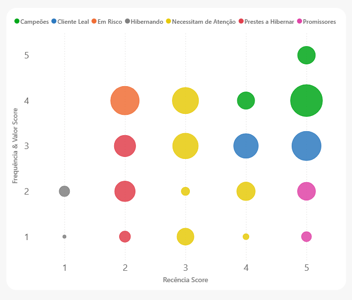
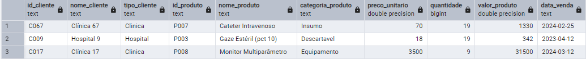
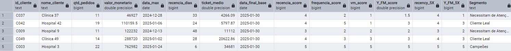
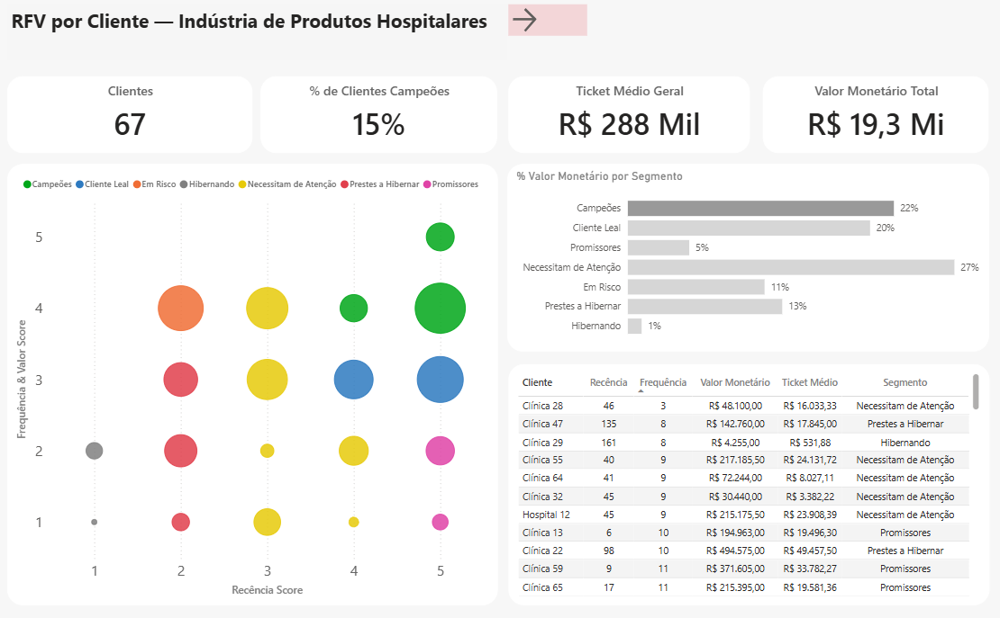
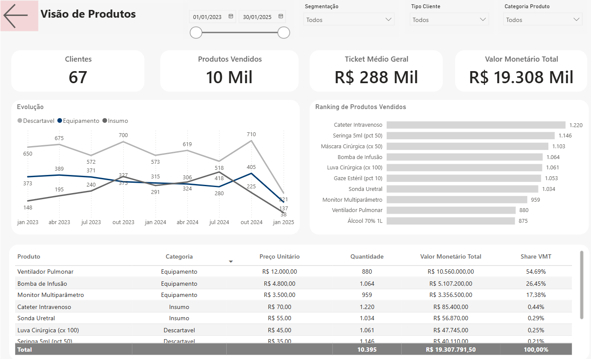
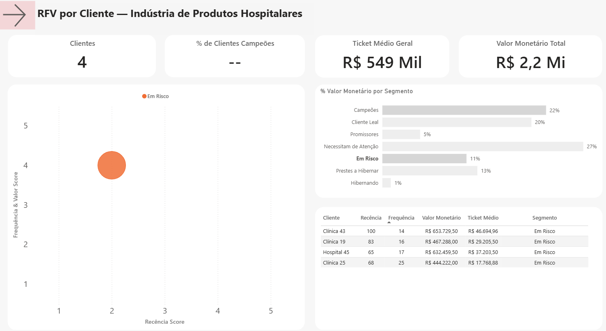
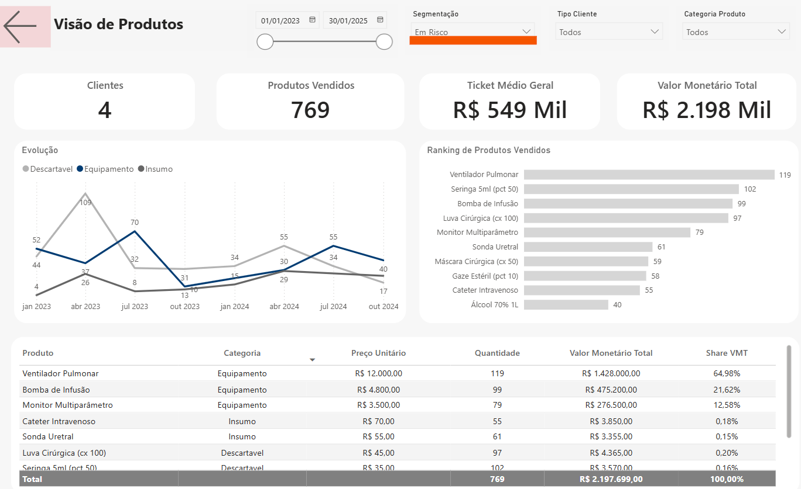

# 🎯 Por que utilizar Análise RFV? 

O modelo RFV (Recência, Frequência, Valor Monetário) é uma técnica consagrada em marketing e CRM para segmentação de clientes. Ele se baseia na premissa de que clientes que compraram **recentemente**, compram com **maior frequência** e gastam **mais valor** tendem a ser os mais valiosos para a empresa.

Para operacionalizar o modelo, cada dimensão é classificada em **escores de 1 a 5,** onde:

- **1 = desempenho fraco** (clientes menos valiosos)

- **5 = desempenho excelente** (clientes mais valiosos)

Essa escala não é arbitrária:

Está documentada em estudos clássicos de marketing direto, como Bult e Wansbeek (1995).

É aplicada em práticas modernas de CRM e análise de comportamento, como descrito em Shopify e Clevertap, recomendando dividir os clientes em quintis (20% melhores recebem score 5, 20% piores recebem score 1).

O uso dessa pontuação facilita a **comparabilidade entre clientes** e permite construir **segmentos estratégicos** (ex.: Campeões, Leais, Em Risco, Hibernando etc.).

Essa fundamentação garante que os scores atribuídos na análise não foram definidos de forma arbitrária, mas seguem uma **literatura consolidada** e reconhecida na área.


  
  <p><em>Figura 1 - Gráfico de dipersão da análise RFV, em que cada ponto um grupo de clientes.<br>As cores indicam os segmentos definidos (Campeões, Leais, Promissores etc.), equanto o tamanho da bolha é proporcional ao valor monetário total..</em></p>
</div>

---

## As variáveis chaves utilizadas são:

---

### 📆 Recência  
A variável mais determinante da RFV. Ela descreve a etapa em que o cliente se encontra, que pode ser definida em três ciclos:

1. **Clientes Futuros →** ainda não compraram (prospectos ou leads).
2. **Clientes Potenciais →** fizeram poucas compras iniciais, ainda em fase de teste. 
3. **Clientes Ativos →** compram com frequência e valor consistentes, sendo a base do relacionamento. 

---

### 🛍 Frequência  
Define o número de vezes que o cliente realizou uma compra. 

Esse indicador está altamente relacionado à **qualidade do produto ou serviço prestado**, demonstrando o quanto a empresa está presente na mente do cliente ao decidir fazer negócios novamente.  

---

### 💰 Valor Monetário
Corresponde ao **valor total gasto** em produtos ou serviços.  

Esse indicador permite identificar consumidores mais ou menos lucrativos.  
Somente a variável de Valor é capaz de estabelecer uma **hierarquia clara**, quando analisada em conjunto com Recência e Frequência.  

---

### Conclusão  
A metodologia **RFV** é a base para qualquer modelo preditivo de comportamento de clientes, pois combina **baixo custo de aplicação** com **alto potencial de aumento de lucratividade**.<br>  

---

👉 E você, já utiliza RFV na sua estratégia de clientes?<br>
<br>

---
# 📊 Análise RFV – Indústria de Produtos Hospitalares

## 📌 Contexto do Projeto
Este projeto aplica a análise **RFV (Recência, Frequência e Valor)** para clientes de uma **indústria fictícia de produtos hospitalares**, que vende insumos, descartáveis e equipamentos médicos para **clínicas pequenas e hospitais grandes**.

A análise tem como objetivo **segmentar clientes por comportamento de compra**, permitindo identificar perfis estratégicos e definir ações de marketing e vendas mais assertivas.

### Recorte de tempo da base: **24 meses (últimos 2 anos)**

⚖️ Regra prática (benchmark)

- B2C / consumo rápido (varejo, e-commerce, delivery) → 3 a 12 meses.
- B2B / consumo médio (SaaS, serviços mensais, clínicas pequenas) → 12 meses.
- B2B / compras longas e caras (hospitalar, indústria, bens de capital) → 18 a 24 meses.

O recorte de 24 meses foi adotado porque os ciclos de recompra de insumos e, principalmente, de equipamentos hospitalares, podem ser mais longos do que 12 meses. Assim, a análise não penaliza clientes de ciclo anual ou bienal.

---

### 🛠️ Tecnologias Utilizadas

- **Banco de Dados**: PostgreSQL
- **Linguagem**: Python (pandas, numpy, SQLAlchemy)
- **Visualização**: Power BI
- **Versionamento e Documentação**: GitHub

---

## ⚙️ Pipeline Analítico

### 1. Estrutura da Base
A base fictícia contém **1.000 registros de venda** e **67 clientes**.  
Cada registro inclui:


  
  <p><em>Figura 2 - Tabela de vendas no PostgresSQL</em></p>


---

### 2. Construção da Tabela RFV
No **PostgreSQL**, foram geradas as variáveis principais:

- `recencia`: dias desde a última compra  
- `frequencia`: número total de pedidos  
- `valor_monetario`: soma total gasta pelo cliente  
- `ticket_medio`: valor médio gasto por pedido  


  
  <p><em>Figura 3 - Tabela RFV no PostgresSQL</em></p>


Exemplo do SQL:
```sql
CREATE OR REPLACE VIEW tabela_RFV AS (
	-- converte a coluna data_venda para data
	WITH convert_data as(
		SELECT id_cliente, nome_cliente, TO_DATE(data_venda, 'YYYY-MM-DD') AS data_venda
		FROM base_vendas_clientes
	),
	-- data mais recente da base
	data_final_base AS(
		SELECT 
		MAX(data_venda) AS data_final_base 
		FROM convert_data	
	),
	-- pegar a data mais recente de compra de cada cliente
	data_maxima AS (
		SELECT
		id_cliente,
		nome_cliente,
		MAX(data_venda) AS data_max
		FROM convert_data
		GROUP BY id_cliente, nome_cliente
	),	
	-- agregações 
	rfv AS (
		SELECT 
		id_cliente,
		nome_cliente,
		COUNT(*) AS qtd_pedidos,
		ROUND(SUM(valor_produto)::numeric, 2) AS valor_monetario
		FROM base_vendas_clientes
		GROUP BY id_cliente, nome_cliente
	)
	-- tabela final
	SELECT 
		rfv.id_cliente,
		rfv.nome_cliente,
		rfv.qtd_pedidos,  -- frequencia
		rfv.valor_monetario, -- valor monetario
		dm.data_max,
		df.data_final_base - dm.data_max AS recencia_dias, -- recencia
		round(rfv.valor_monetario::numeric/rfv.qtd_pedidos,2) AS ticket_medio,
		df.data_final_base
	FROM rfv 
	LEFT JOIN data_maxima AS dm ON rfv.nome_cliente = dm.nome_cliente
	CROSS JOIN data_final_base AS df
)
````

### 3. Scores RFV (Python)

A definição dos scores de 1 a 5 não foi criada de forma arbitrária.  
Cada variável (Recência, Frequência e Valor) passou por **análise exploratória** e, a partir da distribuição estatística, foram definidos os cortes de forma **manual e contextualizada** com o negócio.

**🔃Observação**:
Os cortes de pontuação foram definidos com base na distribuição da base atual e critérios de negócio. Recomenda-se revisão periódica (ex.: a cada semestre) para ajustar a segmentação conforme mudanças no perfil dos clientes e do mercado.

---

**Recência (R)**  
Cortes definidos considerando quantis e média + desvio-padrão  
*(quanto menor a recência em dias, melhor o score).*

- **Score 5** → ≤ **20 dias** (Q1 ≈ 16 dias; arredondado para cima para não penalizar clientes próximos do corte).  
- **Score 4** → ≤ **33 dias** (mediana).  
- **Score 3** → ≤ **64 dias** (Q3).  
- **Score 2** → ≤ **146 dias** (média + 2 desvios-padrão).  
- **Score 1** → > **146 dias**.

---

**Frequência (F)**  
Abordagem híbrida: cortes manuais ajustados pela distribuição observada  
*(quanto mais pedidos, maior o score).*

- **Score 1** → ≤ **11 pedidos** (Q1 ≈ 11).  
- **Score 2** → até **13 pedidos** (mediana ≈ 14; arredondado para baixo para não penalizar).  
- **Score 3** → até **16 pedidos** (entre mediana e Q3).  
- **Score 4** → até **18 pedidos** (próximo de Q3).  
- **Score 5** → > **18 pedidos** (clientes altamente recorrentes).

---

**Valor Monetário (V)**  
Abordagem híbrida: média ± desvio-padrão + ajustes pelos quartis  
*(quanto maior o valor acumulado, maior o score).*

- **Score 1** → ≤ **120k** (média – 1 desvio; mais adequado que usar Q1 ≈ 145k para não ser tão punitivo).  
- **Score 2** → até **250k** (em torno da mediana ≈ 260k).  
- **Score 3** → até **420k** (próximo de Q3).  
- **Score 4** → até **543k** (média + 1.5 desvios).  
- **Score 5** → > **543k**.


Exemplo aplicado ao Valor Monetário:

````python
def calcular_vm(vm):
    if vm <= 120000: return 1
    if vm <= 250000: return 2
    if vm <= 420000: return 3
    if vm <= 543000: return 4
    else: return 5 
````


### 4. Segmentação RFV

Após calcular os scores de Recência (R), Frequência (F) e Valor Monetário (V) e derivar os quintis, foi definida uma função em Python para atribuir **7 segmentos estratégicos** aos clientes.  

A lógica aplicada se baseia na literatura de RFV, adaptada ao contexto do negócio.  
Os cortes combinam a **recência** (tempo desde a última compra) com a média de **frequência + valor monetário (Y_FM)**, de modo a capturar tanto a regularidade quanto a importância financeira do cliente.

#### Lógica aplicada
- **Campeões** → clientes muito recentes e com alta frequência/valor.  
- **Clientes Leais** → clientes recentes com frequência/valor médios.  
- **Promissores** → muito recentes, mas com baixo valor ou frequência.  
- **Necessitam de Atenção** → recência e frequência/valor medianos.  
- **Em Risco** → já tiveram bom valor/frequência, mas estão ficando inativos.  
- **Prestes a Hibernar** → baixa recência e baixa/média frequência/valor.  
- **Hibernando** → clientes inativos há muito tempo.  

#### Implementação em Python

````python
def segmentacao(row):
    r = row['recency_quintis']
    fm = row['Y_FM_5X']

    # 1) Campeões: muito recentes e alto FM
    if r >= 4 and fm >= 4:
        return 'Campeões'
    # 2) Cliente Leal: recente e FM médio
    elif r >= 4 and fm == 3:
        return 'Cliente Leal'
    # 3) Promissores: muito recentes mas FM baixo
    elif r == 5 and fm <= 2:
        return 'Promissores'
    # 4) Necessitam de Atenção: recência média e FM médio
    elif r == 3 and fm == 3:
        return 'Necessitam de Atenção'
    # 5) Em Risco: FM bom/alto, mas recência caiu
    elif r <= 2 and fm >= 4:
        return 'Em Risco'
    # 6) Prestes a Hibernar: recência baixa, FM baixo/médio
    elif r == 2 and fm <= 3:
        return 'Prestes a Hibernar'
    # 7) Hibernando: pior recência
    elif r == 1:
        return 'Hibernando'
    # fallback
    else:
        return 'Necessitam de Atenção'

df['Segmento'] = df.apply(segmentacao, axis=1)
````


## 📊 Ações Recomendadas por Segmento RFV

| Segmento             | Características Principais                                          | Ações de Negócio Sugeridas                                                                 |
|----------------------|---------------------------------------------------------------------|--------------------------------------------------------------------------------------------|
| **Campeões**         | Compram com frequência, gastam alto valor e são recentes.           | Recompensar com programas de fidelidade, ofertas exclusivas e atendimento VIP.              |
| **Clientes Leais**   | Boa frequência e valor médio/alto, recência positiva.               | Criar planos de assinatura ou descontos progressivos, incentivar upsell.                   |
| **Promissores**      | Compraram recentemente, mas com baixo valor ou baixa frequência.    | Oferecer promoções de entrada, kits ou combos para aumentar ticket médio.                  |
| **Necessitam de Atenção** | Frequência e valor medianos, recência em queda.                     | Ações de remarketing (email, WhatsApp), campanhas de “última chance” e reativação.          |
| **Em Risco**         | Tinham alto valor/frequência, mas estão sem comprar há algum tempo. | Ofertas agressivas de retenção, contato direto da equipe comercial, condições especiais.    |
| **Prestes a Hibernar** | Frequência baixa, valor baixo/médio, recência ruim.                   | Estratégias de baixo custo para reativação (cupons, campanhas segmentadas).                 |
| **Hibernando**       | Inativos há muito tempo, baixo valor e baixa frequência.            | Avaliar se vale reativar ou descartar; usar campanhas automatizadas de baixo custo apenas. |

## 📊 Visualização – Power BI

### 🔗[Acesse o dashboard do Power BI](https://app.powerbi.com/view?r=eyJrIjoiMDQwZjdiM2MtNDIxNy00NjY4LTg0NmYtMGZjNzc5YTYwOGFhIiwidCI6IjI4M2VmYTcwLTVjMWMtNGRjMy04YWFjLWMyYTk0M2E2YzQ1NSJ9)

### Aba 1 – RFV (Clientes)

- **KPIs (cards)**: total de clientes, ticket médio, valor acumulado, percentual de campeões
- **Gráfico de dispersão**: recência × frequência/valor (cores por segmento)
- **Tabela detalhada**: cliente, recência, frequência, valor e segmento
- **Barras horizontais**: distribuição por segmento


  <div style="text-align: center;">
  
  <p><em>Figura 4 - Painel RFV.</em></p>
</div>

### Aba 2 – Produtos (RFV + Categorias)

- **KPIs (cards)**: total de clientes, quantidade de produtos vendidos, valor total acumulado, ticket médio
- **Ranking de produtos mais vendidos** (volume e valor)
- **Comparativo % Hospitais × Clínicas** por categoria de produto
- **Tabela detalhada**: produto, categoria, preço unitário, quantidade e valor total
- **Filtro por tipo de cliente, categoria de produto e segmento de cliente** (ex.: o que os Campeões mais compram)


  <div style="text-align: center;">
  
  <p><em>Figura 5 - Painel Visão de Produtos.</em></p>
</div>


## 🔎 Insights

A análise RFV permitiu identificar diferentes perfis de clientes e suas necessidades estratégicas.
Um destaque relevante foram os **clientes em risco**:

- **Representam apenas 4 clientes**, mas concentram **≈ R$ 2,2 milhões em compras**.
- Isso corresponde a **~11% do valor monetário total da base**.
- Em termos de quantidade, o **Ventilador Pulmonar** sozinho aparece com **119 unidades vendidas**, consolidando-se como o produto mais crítico desse grupo.

👉 **Insight estratégico**: embora pequenos em número, esses clientes têm grande impacto financeiro. Se não forem reativados, a perda pode comprometer significativamente o faturamento. Ações de retenção personalizadas, como ofertas exclusivas, atendimento consultivo e condições comerciais diferenciadas, são fundamentais para evitar churn desse grupo


  
  <p><em>Figura 6 - Painel RFV por Cliente, filtrado por segmento em Risco</em></p>


  
  <p><em>Figura 7 - Painel Visão de Produtos, filtrado por segmento em Risco</em></p>


## 🚀 Conclusão

A análise RFV permitiu **segmentar os clientes e identificar perfis estratégicos**, trazendo clareza sobre quem são os campeões, quem está em risco e quem pode ser perdido.
Além disso, a segunda aba focada em **produtos** mostrou **padrões de consumo** relevantes para apoiar **estratégias comerciais**.


